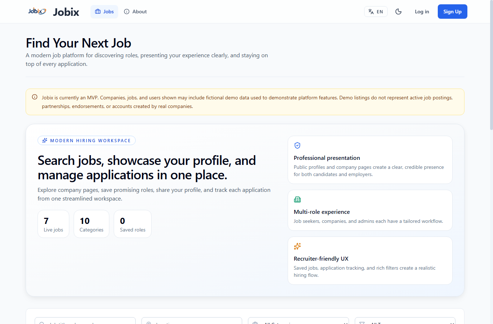
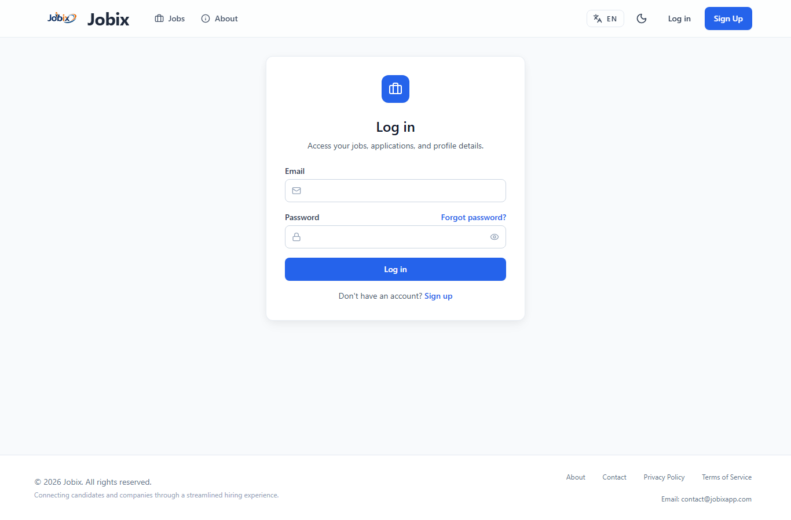
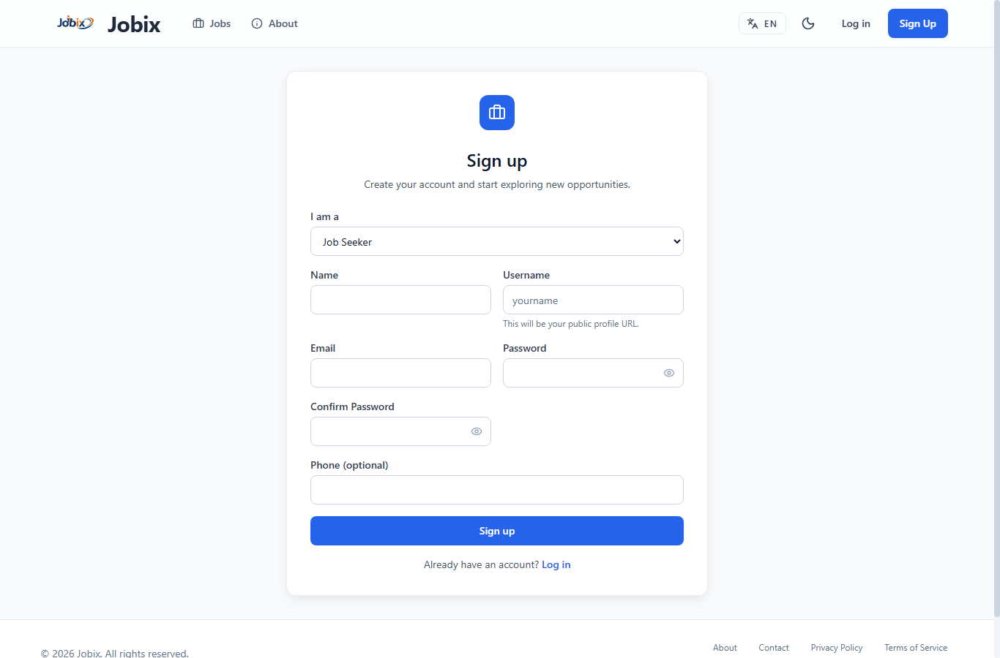
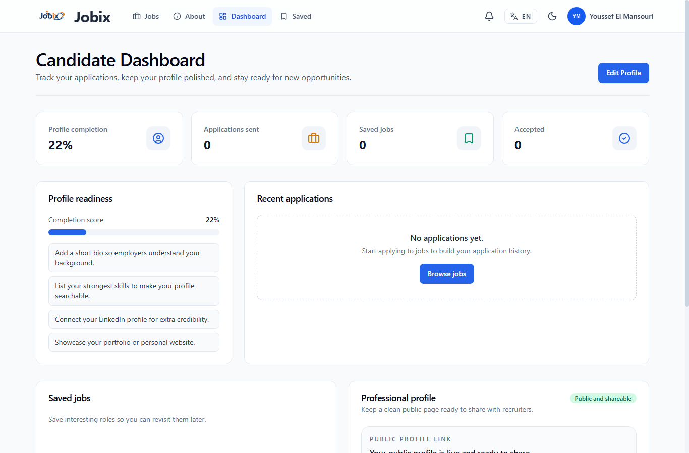
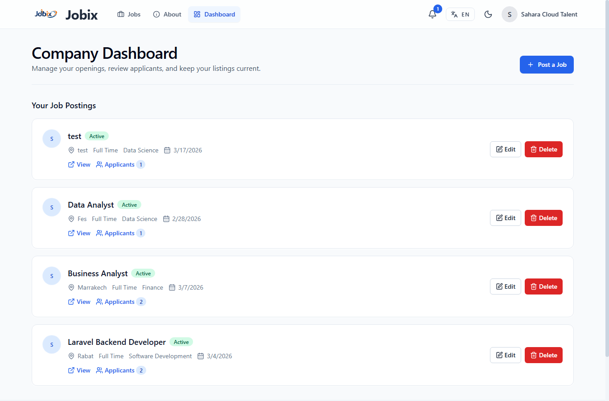
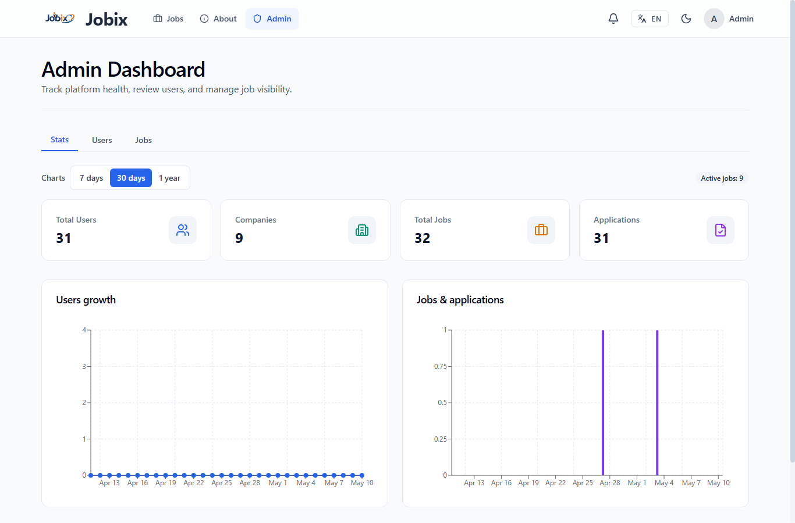
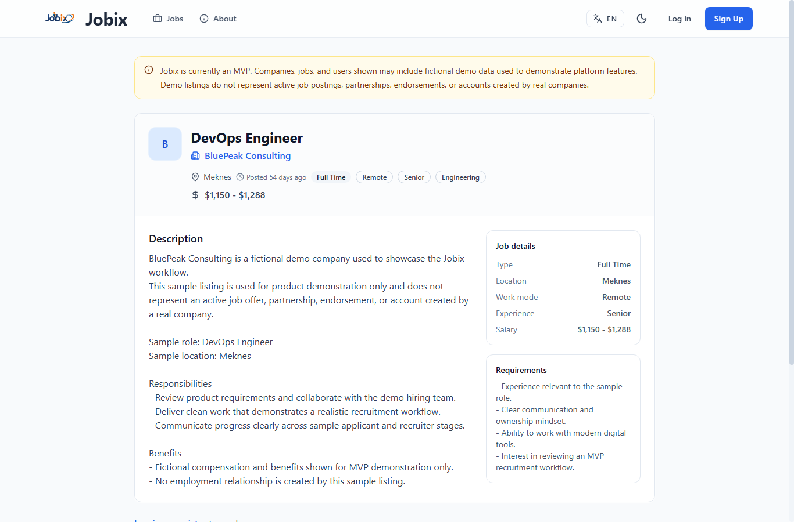
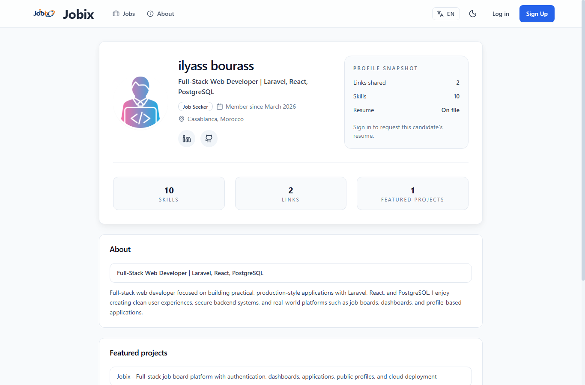

# Jobix

Jobix is a full-stack job board platform built with Laravel and React.

It helps job seekers discover roles, save jobs, apply with a resume, and manage a public profile. Companies can publish jobs, review applicants, and manage hiring workflows. Admins can monitor the platform and moderate users and job listings.

## Live Site

- Frontend: [https://www.jobixapp.com/](https://www.jobixapp.com/)
- API: [https://jobix.onrender.com](https://jobix.onrender.com)

## Source Code

The source code for Jobix is private. This public repository is a showcase with the live site link, feature overview, stack summary, and screenshots.

## Highlights

- Authentication with email verification
- Forgot-password and reset-password flows
- Job search, filters, saved jobs, and applications
- Resume upload, avatars, company logos, and public profiles
- Company dashboard for posting jobs and reviewing applicants
- Admin dashboard for platform stats, users, jobs, and moderation
- Cloud file storage and transactional email integration

## Tech Stack

- Frontend: React, Vite, Tailwind CSS, React Query
- Backend: Laravel 10, PHP
- Database: PostgreSQL on Neon
- Hosting: Vercel and Render
- Storage: Cloudflare R2
- Email: Brevo API

## Screenshots

### Homepage

### Login

### Register

### Candidate Dashboard

### Company Dashboard

### Admin Dashboard

### Job Details

### Public Profile

## Portfolio Notes

Jobix demonstrates practical product engineering across frontend UI, backend API design, authentication, file uploads, cloud database deployment, storage, email delivery, and role-based dashboards.
